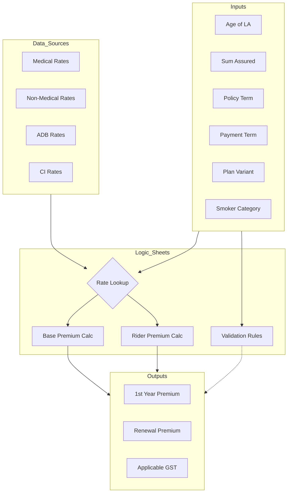

# Math Logic & Calculation Flow

This document details the core mathematical logic extracted from the `BI_eTouch II_V05_Ver09.xlsb` workbook.

## High-Level Flow

## Core Calculations

### 1. Base Instalment Premium
The base premium is derived from the lookup rate adjusted by Sum Assured and Mode.

**Formula**:
`Base Premium = (Rate / 1000) * Sum Assured * Modal Factor`

- **Rate**: Looked up from `Medical_Rates` or `Non_Medical_Rates`.
    - *Example (Medical)*: `VLOOKUP([Lookup_Key], Medical_Rates, 9, 0)`
    - *Lookup Key*: Typically a concatenation of Age, Gender, PT, PPT, for example: `26M5910LSNSR` (Age 26, Male, PT 59, PPT 10, Variant LS, Non-Smoker, Resident).
- **Modal Factor**: Typically `1.0` for Annual, `0.083` for Monthly (varies by plan).

### 2. Accidental Death Benefit (ADB)
**Formula**:
`ADB Premium = (ADB_Rate / 1000) * ADB_Sum_Assured`

- **ADB_Rate**: Sourced from `ADB_Rates` based on Age and Variant.
    - *Example*: `VLOOKUP([ADB_Key], ADB_Rate, MATCH("Rate", ADB_Header, 0), 0)`

### 3. Critical Illness (CI) Rider
**Formula**:
`CI Premium = CI_Rate * CI_SA` (if selected)

- **CI_Rate**: Fetched from `CI_Rates` table.

### 4. Care Plus Rider
**Formula**:
`Care Plus Premium = Care_Rider_Rate * Care_Rider_SA * Mode_Factor`

- **Multiplier**: `Care_Plus_SA` is often derived as `[Annualized_Premium] * [Multiplier]`.

### 5. Validation Logic
The system performs several checks before finalizing the premium:
- **Max Maturity Age**: `Age + PT <= 85`
- **Minimum SA**: Check against plan minimums.
- **TASA Eligibility**: Determined by Total Annualized Premium and Net Annualized Income.

## Legend
- `[Label]`: Refers to a cell on the `Input` or `Output` sheet.
- `NamedRange`: Refers to a specific cross-sheet reference defined in Excel.
