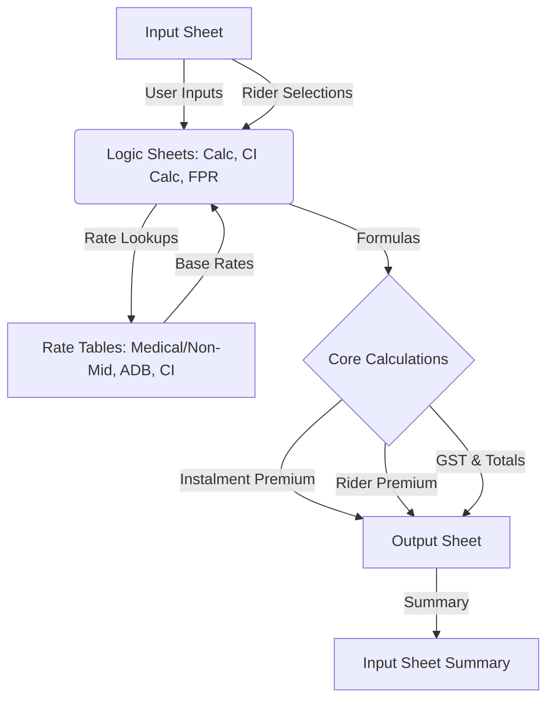

# Excel Logic Extraction Project

This project extracts and documents the mathematical logic from the `BI_eTouch II_V05_Ver09.xlsb` Excel workbook. It provides tools to automate data extraction, formula tracing, and logic explanation.

## Project Structure

- `BI_eTouch II_V05_Ver09.xlsb`: The source Excel workbook.
- `extract_data.py`: Extracts raw cell values using `python-calamine`.
- `extract_formulas.ps1`: Extracts cell formulas using Excel COM Interop (needed for .xlsb support).
- `build_logic_summary.py`: Processes extracted data into human-readable logic reports.
- `extracted_data.json`: Raw values from the workbook.
- `extracted_formulas_com.json`: Raw formulas and values from targeted sheets.
- `math_logic_report.md`: A detailed report of the mathematical logic mapped to descriptive labels.

## Data Flow



## How it Works

1.  **Formula Extraction**: Since `.xlsb` files store formulas in a binary format, we use a PowerShell script (`extract_formulas.ps1`) to leverage Excel's own engine via COM to read the formulas.
2.  **Label Mapping**: We scan the `Input` and `Output` sheets to find labels (like "Age of Life Assured") and map them to their corresponding cell addresses.
3.  **Logic Simplification**: Formulas like `Input!D197` are automatically translated to `[Age of Life Assured]` for better readability.

## Frontend
--------

A lightweight Vite frontend was added under `web/`. It reads prepared JSON files from `web/public` and shows a per-sheet table of formulas and simplified logic.

Quick start (Windows PowerShell):

```powershell
npm install
npm run dev
```

The `dev` script runs a small preparer that copies `extracted_data.json` and related files into `web/public` then starts Vite. Open http://localhost:5173.
## Usage

To re-run the extraction:

1.  **Extract Data**: `python extract_data.py "BI_eTouch II_V05_Ver09.xlsb" Input Calc Output`
2.  **Extract Formulas**: `powershell -ExecutionPolicy Bypass -File extract_formulas.ps1 -filePath "BI_eTouch II_V05_Ver09.xlsb" -sheetNames "Calc","Input","Output"`
3.  **Build Logic Summary**: `python build_logic_summary.py`

The final logic report will be generated in `math_logic_report.md`.
